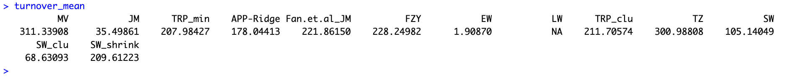
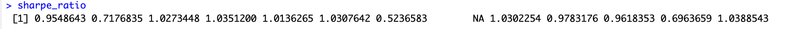
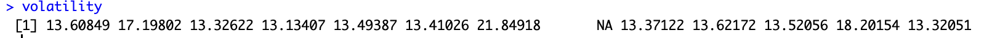
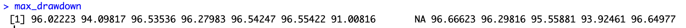
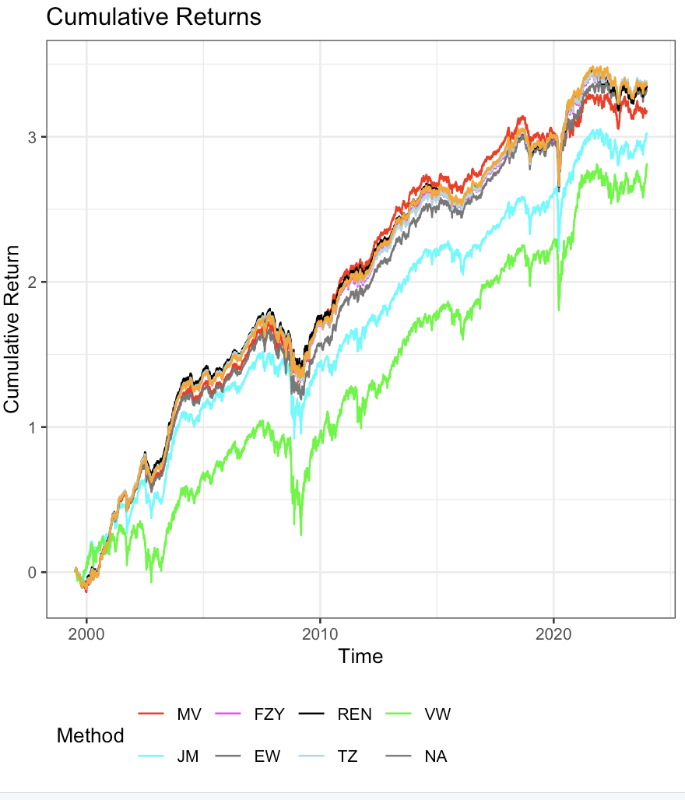
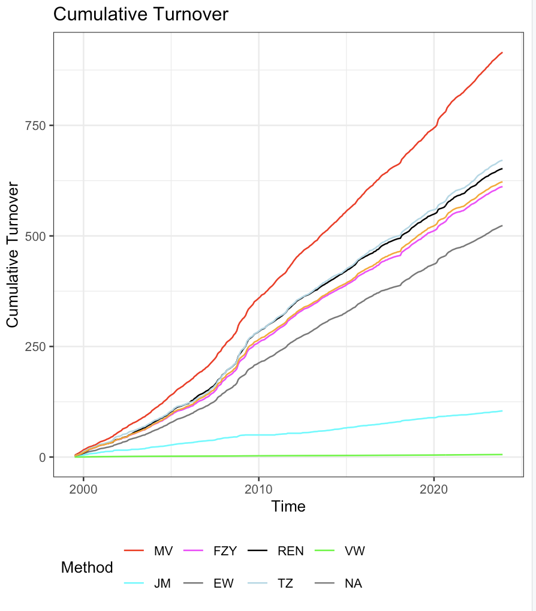

```{r, include = FALSE}
knitr::opts_chunk$set(
  collapse = TRUE,
  comment = "#>"
)
```

```         
library(REN)
```

## Introduction

The REN package provides tools for robust portfolio optimization using regularization techniques and ensemble learning methods. It is designed to generate stable out-of-sample return predictions, particularly in the presence of strong correlations among assets. The package includes functions for data preparation, parallel processing, and portfolio analysis using various methods like Mean-Variance, James-Stein, LASSO, Ridge Regression, and Equal Weighting.

This vignette will walk you through the main functionalities of the REN package, demonstrating how to set up the environment, prepare data, and perform portfolio optimization.

## Installation

You can install the development version of the REN package from GitHub:

```         
devtools::install_github("bonsook/REN")
```

## Setting Up Parallel Processing

The REN package leverages parallel processing to speed up computation, especially when dealing with large datasets or complex models. Use the `setup_parallel` function to set up parallel processing.

### Example

```         
# Set up parallel processing with the default number of cores or choose a specific number
cl <- setup_parallel()
```

## Preparing the Data

The `prepare_data` function is designed to help you structure your input data appropriately for portfolio optimization. This function handles various preprocessing steps, making it easier to analyze the data using the REN package.

### Example with FF25 Dataset

In this example, we use the FF25 dataset, which consists of 25 portfolios formed on size and book-to-market ratios. This dataset is commonly used in financial research to analyze asset pricing models and portfolio performance. It provides monthly returns of 25 portfolios that are intersections of five portfolios formed on size and five portfolios formed on book-to-market equity.

### What is the FF25 Dataset?

The FF25 dataset, derived from the Fama-French 25 portfolios, is a widely-used financial dataset that contains monthly returns of portfolios formed by sorting stocks into quintiles based on market capitalization (size) and book-to-market ratios. This data is instrumental in understanding market efficiency, asset pricing, and performance analysis across different market segments.


### Example Data Preparation

Suppose you have a data frame `your_data` with asset returns:

```         
# Load the dataset (replace with your actual data path)
ff25 <- read.csv("data/FF25.csv")

# Define the date column index, start date, and end date
date_column_index <- 1  # Update this based on your data
start_date <- "19990101"  # Adjust as needed
end_date <- "20231231"  # Adjust as needed

# Prepare the data for analysis
data_prep <- prepare_data(ff25, date_column_index, start_date, end_date)
x <- data_prep$x
mon <- data_prep$mon
count <- data_prep$count
Date <- data_prep$Date
```

The `prepare_data` function processes your data, making it ready for portfolio optimization.

## Performing Portfolio Analysis

The core function of the REN package is `perform_analysis`, which performs portfolio optimization using multiple methods, including Mean-Variance (MV), James-Stein (JM), LASSO, Ridge Regression, and Equal Weighting (EW). The function calculates various performance metrics such as turnover, Sharpe ratio, volatility, and maximum drawdown.

### Example

Let's perform portfolio analysis on the prepared data:

```         
# Perform the portfolio analysis
result <- perform_analysis(x, mon, count, Date, num_cores)

# Accessing the results
cumulative_return_plot <- result$cumulative_return_plot
turnover_plot <- result$cumulative_turnover_plot
turnover_mean <- result$turnover_mean
sharpe_ratio <- result$sharpe_ratio
volatility <- result$volatility
max_drawdown <- result$max_drawdown
```


# Outputs 


### 1. *Turnover Mean* 


{width="686" height="68"}


   - This measures the average portfolio turnover, which relates to trading frequency and transaction costs.
   
   - REN’s turnover is moderate, suggesting it strikes a balance between performance and transaction costs.
   
   - MV has a very high turnover of 311.34, indicating frequent rebalancing, which might lead to higher transaction costs.
   
   - The EW method has the lowest turnover, almost negligible, which might reflect a more static portfolio.


### 2.*Sharpe Ratio*


{width="697"}


 
   - The Sharpe Ratio measures risk-adjusted returns, with higher values indicating better risk-adjusted performance.
   
   - Most methods have Sharpe ratios between 0.5 and 1.03.
   
   - REN has a Sharpe ratio of approximately 1.03, indicating good risk-adjusted returns relative to others.
   
   - JM and TZ also have competitive Sharpe ratios above 1.0, while EW shows a significantly lower Sharpe ratio of around 0.52, indicating poor risk-adjusted performance.


### 3. *Volatility*


{width="696" height="28"}
 
   - This measures the standard deviation of returns, indicating the level of risk.
   
   - Volatility values range from 13.1 to 21.8, with REN showing a volatility around 13.6, placing it in the lower-risk group.
   
   - TZ exhibits the highest volatility, around 21.85, suggesting it carries the most risk.
   
   - Methods like MV and JM are slightly more volatile compared to REN but still remain relatively stable.


### 4. *Maximum Drawdown* 


{width="688" height="29"}

   - Maximum drawdown measures the largest peak-to-trough decline of the portfolio.
   
   - Most methods have a high maximum drawdown percentage, with values ranging from around 91% to 96%.
   
   - REN (likely 96.02223) seems to have a moderate drawdown compared to others, suggesting a reasonable risk profile.
   
   - Methods like JM show relatively better performance in terms of drawdown, with a value around 91%.


### 1. *Cumulative Returns Plot* 

```         
print(cumulative_return_plot)
```

{width="484"}


   - This plot compares the cumulative returns over time for various portfolio optimization methods (MV, FZY, REN, VW, JM, EW, TZ, NA).
   
   - The REN method (in black) performs well and closely follows the top-performing method.
   - MV (in red) has high cumulative returns but exhibits higher volatility compared to others.
   
   - The green line (VW) has the lowest cumulative return, indicating this method underperforms relative to others.
   
   - REN's performance is steady and competitive with FZY, showing it is a reliable strategy for portfolio returns.


### 2. *Cumulative Turnover Plot*

```         
print(turnover_plot)
```

{width="503"}

   - This plot shows the cumulative turnover over time, tracking how often portfolios are rebalanced.
   
   - MV's line (in red) shows consistently high cumulative turnover, confirming frequent rebalancing.
   
   - REN has moderate cumulative turnover, performing similarly to FZY and NA.
   
   - VW again shows minimal turnover, reinforcing its more static nature.
   
   - A lower turnover might suggest lower trading costs, but it can also limit responsiveness to market changes.


#### Once you're done with the parallel computation, remember to stop the cluster to free up resources:

# Stop the parallel cluster

```         
stopCluster(cl)
```


## Conclusion

The REN package provides a comprehensive set of tools for robust portfolio optimization using regularization and ensemble learning methods. By following the steps outlined in this vignette, you can effectively set up your environment, prepare your data, and perform in-depth portfolio analysis.

For further information, please refer to the package documentation or explore the examples provided in this vignette.
